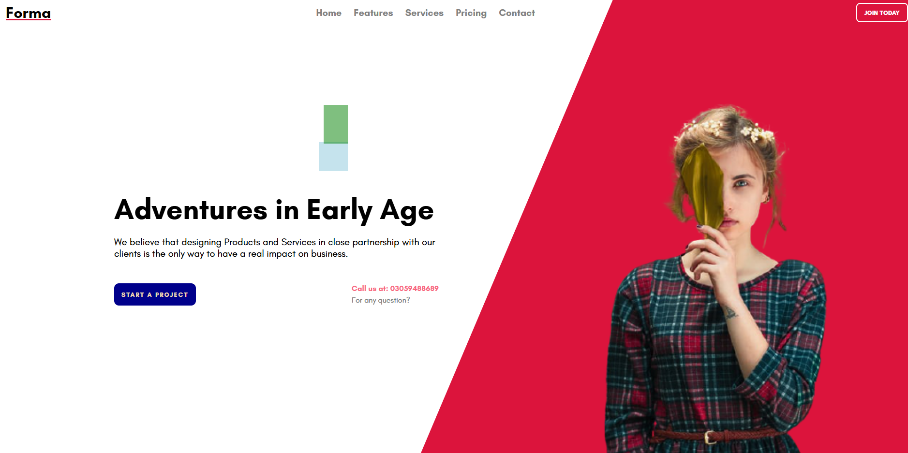

# Forma

A creative landing page concept built with React 17 and styled-components. Features a pink visual theme, a design process section, pricing cards, and a contact section.

This is a frontend design showcase, not a complete service or product. The contact form opens an email draft in your email app; it does not send messages through a backend.

## Preview



## Run locally

With Node.js and npm installed, run these commands from the project folder:

```sh
npm install
npm start
```

Open http://localhost:3000 (or the address shown in your terminal).

If PowerShell blocks `npm`, use `npm.cmd` instead. The start and build scripts include the OpenSSL compatibility flag used with this project's older build tools.

## Production build

```sh
npm run build
```

The output is saved to `build/`.

## Project files

- `src/components/` - page sections and their styles.
- `src/images/` - image assets.
- `public/` - HTML template, fonts, and Forma favicon.
- `docs/` - README screenshots.
